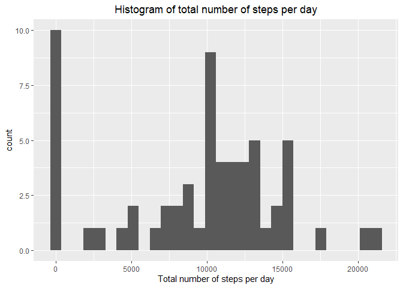
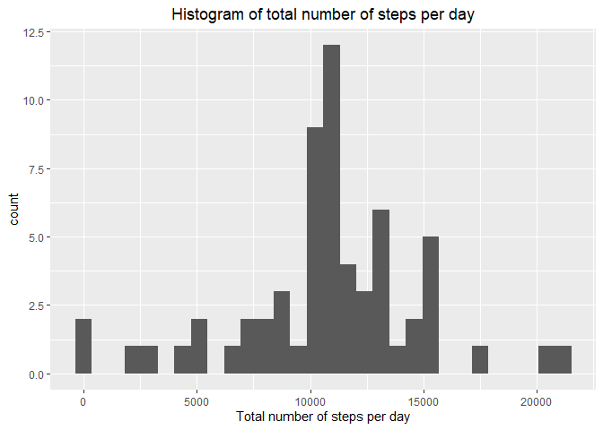

Author: Kingsley O. Akpeji


```r
knitr::opts_chunk$set(warning = FALSE, message = FALSE, results = "asis")
```

##Introduction
It is now possible to collect a large amount of data about personal movement using activity monitoring devices such as a [Fitbit](http://www.fitbit.com/) , [Nike Fuelband](http://www.nike.com/us/en_us/c/nikeplus-fuelband), or [Jawbone Up](https://jawbone.com/up). These type of devices are part of the “quantified self” movement – a group of enthusiasts who take measurements about themselves regularly to improve their health, to find patterns in their behavior, or because they are tech geeks. But these data remain under-utilized both because the raw data are hard to obtain and there is a lack of statistical methods and software for processing and interpreting the data.  

This analysis makes use of data from a personal activity monitoring device. This device collects data at 5 minute intervals through out the day. The data consists of two months of data from an anonymous individual collected during the months of October and November, 2012 and include the number of steps taken in 5 minute intervals each day.

The data for this analysis can be downloaded from [this site](https://d396qusza40orc.cloudfront.net/repdata%2Fdata%2Factivity.zip)


The variables included in this dataset are:

* steps: Number of steps taking in a 5-minute interval (missing values are coded as \color{red}{\verb|NA|}NA)  

* date: The date on which the measurement was taken in YYYY-MM-DD format  

* interval: Identifier for the 5-minute interval in which measurement was taken
The dataset is stored in a comma-separated-value (CSV) file and there are a total of 17,568 observations in this dataset.


## Loading and preprocessing the data
First, load the libraries needed for the entire analysis.


```r
library(lubridate)
library(dplyr)
library(ggplot2)
library(lattice)
```

Read in data file (unzipped).


```r
steps_dt <- read.csv(file = unzip("activity.zip"), header = T)
```

Transform date variable into an R date format.


```r
steps_dt$date <- ymd(steps_dt$date)
```

## What is mean total number of steps taken per day?
Group data by month and day, and calculate total number of steps taken per day.

```r
tot_steps_day <- steps_dt %>% group_by(month(date), day(date)) %>% 	summarise(total_steps = sum(steps, na.rm = T))
```

Plot histogram of total number of steps taken per day.


```r
p_steps_day <- ggplot(tot_steps_day, aes(total_steps))
p_steps_day + geom_histogram() + 
	labs(x = "Total number of steps per day",
		title = "Histogram of total number of steps per day") +
	theme(plot.title = element_text(hjust = 0.5))
```

<!-- -->

Calculate mean and median of total steps per day.


```r
mean_tot_steps_day <- mean(tot_steps_day$total_steps)
med_tot_steps_day <- median(tot_steps_day$total_steps)
```

The mean and median total number of steps taken each day are `{r} mean_tot_steps_day` and `{r} median_tot_steps_day`, respectively.

## What is the average daily activity pattern?

The following time series plot shows the average daily activity pattern of the individual.


```r
ave_act_day <- steps_dt %>% group_by(month(date), day(date), interval) %>%  summarise(ave_steps_int = mean(steps, na.rm = T))
```

The 5-minute interval with the largest number of steps on average, across all days is obtained thus:


```r
ave_act_day$interval[ave_act_day$ave_steps == max(ave_act_day$ave_steps)]
```

integer(0)


## Imputing missing values
tot_NA <- sum(!complete.cases(steps_dt))
p_NA <- mean(is.na(steps_dt$steps))

The total number of rows missing values in the dataset is `{r} tot_NA`, i.e. `{r}p_NA`% of rows.

The missing values in the dataset were filled using the mean for the corresponding 5-minute interval.


```r
steps_dt$ave_steps_int <- ave_act_day$ave_steps_int

steps_dt[!complete.cases(steps_dt), "steps"] <- 
	steps_dt[!complete.cases(steps_dt), "ave_steps_int"]
```

After imputing missing values, we recalculate total number of steps taken per day, re-plot the histogram of total number of steps per day, and re-calculate the mean and median of the total number of steps per day.


```r
tot_steps_day2 <- steps_dt %>% group_by(month(date), day(date)) %>% 
				summarise(total_steps2 = sum(steps, na.rm = T))
```

Plot histogram of total number of steps taken per day.


```r
p_steps_day2 <- ggplot(tot_steps_day2, aes(total_steps2))
p_steps_day2 + geom_histogram() + 
	labs(x = "Total number of steps per day",
		title = "Histogram of total number of steps per day") +
	theme(plot.title = element_text(hjust = 0.5))
```

<!-- -->

Recalculate mean and median of total steps per day.

```r
mean_tot_steps_day2 <- mean(tot_steps_day2$total_steps2)
med_tot_steps_day2 <- median(tot_steps_day2$total_steps2)
```

After imputing missing values, the mean and median total number of steps are
`{r} mean_tot_steps_day2` and `{r}median_tot_steps_day2`, respectively.

The impact of imputing missing data on the estimates of the total daily number of steps is illustrated using the barplot below.


```r
tot_mean_med <- c(mean_tot_steps_day, mean_tot_steps_day2, med_tot_steps_day,  
			   med_tot_steps_day2)
bplt_legend <- c("Mean of total daily steps without NAs",
			 "Mean of total daily steps with NAs filled",
			 "Median of total daily steps without NAs",
			 "Median of total daily steps with NAs filled")
bplt_col <- c("red", "yellow", "brown", "orange")

barplot(tot_mean_med, col = bplt_col, legend.text = bplt_legend, 
	   args.legend = list(x = "right"))
```

<!-- -->

The barplot shows that, after imputing missing values, the median and mean of the total number of steps increased slightly.

## Are there differences in activity patterns between weekdays and weekends?

The differences in the activity pattern between weekday and weekend is assessed thus:

Create a new factor variable that indicate designates each day in the dataset as weekday or weekend.


```r
day_type <- rep("weekday", dim(steps_dt)[1])
day_type[weekdays(steps_dt$date) %in% c("Saturday","Sunday")] = "weekend"
steps_dt$day_type <- as.factor(day_type)
```

Calculate the average steps within each 5-min interval across weekday and weekends.


```r
ave_act_dayty <- steps_dt %>% group_by(day_type, interval) %>% 
			summarise(ave_steps = mean(steps))
```

Make panel plot comparing average activity for each day type.


```r
xyplot(ave_steps ~ interval | day_type, data = ave_act_dayty, layout = c(1,2),
	  type = 'l', main = "Comparison of weekday and weekend activity pattern",
	  xlab = "5-minute interval", ylab = "Average number of steps")
```

<!-- -->

The panel plot shows that the individual's activity patterns on weekdays and weekend are similar between 0000 - 1000 and 2100 - 2355. Activity is lowest in the early morning hours and towards midnight, and highest between the 0700 - 1000 interval on both weekdays and weekdays. Perhaps, the individual does some morning jogging and moves more frequently between 0700 - 1000. Activity between 1000 - 2200 on weekend is higher than that of weekday, indicating that the individual is more 'feet-mobile' during this period on weekends than on weekends.
